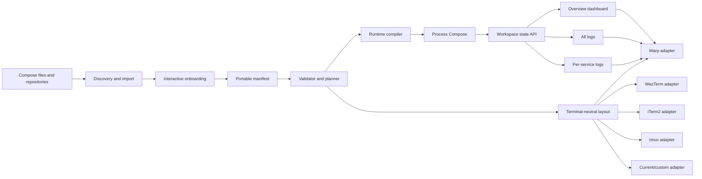
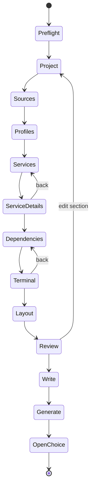

# Rungrid CLI Product Specification

Status: implementation specification
Specification version: 1.1.0
Target product version: 1.0.0
Executable: `rungrid`
Go module: `github.com/jamesonstone/rungrid`
Tagline: `🌊 Unified Development Workspace Observability`
Primary platforms: macOS and Linux
License: Apache-2.0

## 1. Purpose

This document is the normative implementation specification for extracting the
current Process Compose and terminal-tab development workflow into a standalone
tool and repository.

The product is **Rungrid**, a workspace compiler and local-development
orchestrator. It discovers services from Docker Compose and repositories,
interactively confirms anything that cannot be inferred safely, writes one
portable manifest, compiles that manifest into Process Compose runtime
configuration, and opens an overview plus service-specific tabs in the user's
chosen terminal emulator.

Its canonical tagline is **🌊 Unified Development Workspace Observability**.
The text, capitalization, spacing, and wave emoji MUST be reproduced exactly in
the README, root command metadata, release description, and other short-form
product identity surfaces.

An implementation is complete only when it satisfies the behavior, safety
requirements, command contracts, schemas, tests, and acceptance criteria in this
document. Passing a build alone is not sufficient.

### 1.1 Normative language

The words **MUST**, **MUST NOT**, **REQUIRED**, **SHALL**, **SHALL NOT**,
**SHOULD**, **SHOULD NOT**, **RECOMMENDED**, **MAY**, and **OPTIONAL** are to be
interpreted as described by RFC 2119 and RFC 8174.

Examples are explanatory unless they are explicitly called normative.

### 1.2 Product vocabulary

| Term | Meaning |
| --- | --- |
| workspace | A named set of development services and their presentation |
| manifest | The checked-in, portable `.rungrid.yaml` file |
| local override | The optional, ignored `.rungrid.local.yaml` file |
| generated artifact | A machine-local Process Compose, launcher, or terminal file |
| service | One independently observable runtime in the workspace |
| runtime backend | The supervisor that starts, monitors, and stops services |
| terminal adapter | A provider that turns a terminal-neutral layout plan into tabs |
| overview | A live, aggregated status view for the whole workspace |
| all-logs view | A merged, service-prefixed stream of all selected services |
| service view | A full terminal tab following one service's output |
| Compose import | Discovery of service topology from Compose without treating it as native-runtime truth |
| managed file | A generated file containing a Rungrid ownership marker |
| project ID | A stable, machine-safe identity derived from the manifest |

### 1.3 CLI-family reference

The structural reference for the product is the local `yp` CLI repository:

```text
/Users/jamesonstone/go/src/github.com/jamesonstone/yp
```

The inspected reference revision is
`17dc7ebdda6eebc7e9e86bd97e3cb22827d17a5e` dated 2026-05-29. Its material
conventions are restated completely in section 6, so implementation MUST NOT
depend on that local checkout remaining available or unchanged.

## 2. Product goals

Rungrid MUST:

1. Convert an existing multi-service development workflow into a reusable,
   repository-independent product.
2. Import service inventory and safe structural facts from one or more Compose
   files.
3. Support fully interactive onboarding when no manifest exists.
4. Allow the user to choose Warp, WezTerm, iTerm2, tmux, the current terminal,
   or a custom terminal adapter.
5. Open one overview tab, optionally one all-logs tab, and optionally one tab
   per service.
6. Keep services alive independently of the terminal window when the runtime is
   started in detached mode.
7. Use Process Compose as the version 1 runtime supervisor.
8. keep the portable manifest free of machine-local absolute paths and resolved
   secrets.
9. Generate machine-local files atomically and remove only files it owns.
10. Offer deterministic, non-interactive commands suitable for scripts and CI.
11. Report exact plans before mutation and support JSON output for automation.
12. Be useful for both monorepos and collections of sibling repositories.

## 3. Non-goals

Version 1 SHALL NOT:

1. Replace Docker Compose as a container orchestrator.
2. Reimplement Process Compose's process supervisor.
3. Provision cloud infrastructure or production deployments.
4. Infer native host commands from container commands without confirmation.
5. Store environment-variable values, secrets, authentication tokens, or
   decrypted `.env` content in the manifest or generated runtime config.
6. Synchronize source repositories or automatically run `git pull`.
7. edit shell startup files.
8. install terminal emulators without explicit user action.
9. support native Windows terminals. WSL MAY use the Linux behavior, but this is
   not a version 1 acceptance target.
10. promise that every third-party terminal can create tabs. Unsupported
    terminals use the `current` adapter or a custom adapter.

## 4. Product principles

### 4.1 Compose is an import source, not the workspace authority

Compose describes container behavior. A useful local workspace may run the same
service natively, through Compose, as an already-running external dependency, or
not at all. Import MUST therefore create a draft, record provenance and
confidence, and require confirmation for ambiguous runtime decisions.

### 4.2 The manifest is portable; generated files are disposable

`.rungrid.yaml` MUST use paths relative to the workspace root wherever
possible. Absolute repository paths, executable paths, sockets, and terminal
installation paths belong only in the machine-local generated state.

### 4.3 Runtime and presentation are separate

Process Compose owns process lifetime and logs. Terminal adapters own windows
and tabs. The core CLI owns the neutral layout plan and MUST NOT encode
terminal-specific details into the service model.

### 4.4 Inference must be visible and reversible

Every onboarding inference MUST include:

- a source;
- a confidence (`high`, `medium`, or `low`);
- a human-readable reason;
- whether confirmation is required.

The final review screen MUST show which values were inferred and which were
explicitly selected.

### 4.5 Safety takes precedence over convenience

Rungrid MUST refuse to overwrite unmanaged files, MUST redact
sensitive values, MUST use exact project-scoped paths, and MUST make destructive
operations recoverable or narrowly bounded.

## 5. High-level architecture



The architecture SHALL contain these layers:

1. **Discovery** reads raw Compose YAML, optional normalized Compose structure,
   filesystem metadata, and conventional project files.
2. **Onboarding** resolves ambiguities through an interactive state machine.
3. **Model** parses, merges, validates, and normalizes the manifest.
4. **Planner** computes all writes, subprocesses, service changes, and terminal
   actions without performing them.
5. **Compiler** renders a Process Compose configuration and project-scoped
   machine artifacts.
6. **Runtime** owns Process Compose lifecycle and its Unix-domain-socket client.
7. **Dashboard** renders a product-owned aggregate view.
8. **Terminal adapters** compile a terminal-neutral layout into provider actions.
9. **State store** records generated-artifact hashes, active runtime identity,
   schema version, and ownership.

No terminal adapter may import the onboarding or runtime implementation package.
No Compose importer may write files.

## 6. Implementation technology

### 6.1 Language and binary

The product MUST be a single Go binary named `rungrid`. The minimum Go
language version is Go 1.26. The initial `go.mod` MUST contain `go 1.26` and
`toolchain go1.26.5`; routine security updates MAY raise the patch toolchain
without changing the language version. CI MUST test Go 1.26 and the current
stable Go release.

The implementation SHOULD use:

- Cobra for command routing and shell completions;
- Bubble Tea, Bubbles, and Lip Gloss for interactive onboarding and dashboard;
- `gopkg.in/yaml.v3` for preservation-aware YAML parsing;
- `github.com/compose-spec/compose-go/v2` for normalized Compose structure;
- the Go standard library for subprocesses, hashing, locking, JSON, and HTTP
  over Unix-domain sockets.

Dependencies MUST be pinned through `go.mod` and `go.sum`. A dependency may be
replaced only if all public behavior and tests in this specification remain
unchanged.

### 6.2 Standalone repository layout

The repository MUST follow the structural conventions of
`/Users/jamesonstone/go/src/github.com/jamesonstone/yp`: the executable entry
point is a small root `main.go`, public command assembly lives under `cmd/`,
implementation packages live under `internal/`, the build output lives under
`bin/`, and root-level `Makefile`, `README.md`, `.goreleaser.yaml`, `go.mod`, and
`go.sum` files define the developer and release entrypoints.

Rungrid is materially larger than `yp`, so it retains the additional
internal packages, schema, test fixtures, and documentation needed by this
specification. The required layout is:

```text
rungrid/
├── .github/
│   └── workflows/
│       ├── ci.yml
│       └── release.yml
├── cmd/
│   ├── adapters.go
│   ├── config.go
│   ├── dashboard.go
│   ├── doctor.go
│   ├── generate.go
│   ├── init.go
│   ├── lifecycle.go
│   ├── logs.go
│   ├── root.go
│   ├── status.go
│   └── version.go
├── docs/
│   ├── adapters.md
│   ├── manifest.md
│   └── troubleshooting.md
├── internal/
│   ├── adapter/
│   │   ├── current/
│   │   ├── custom/
│   │   ├── iterm2/
│   │   ├── tmux/
│   │   ├── warp/
│   │   └── wezterm/
│   ├── app/
│   ├── atomicfile/
│   ├── composeimport/
│   ├── dashboard/
│   ├── discovery/
│   ├── envprovider/
│   ├── execsafe/
│   ├── manifest/
│   ├── onboarding/
│   ├── planner/
│   ├── processcompose/
│   ├── project/
│   ├── redaction/
│   ├── state/
│   └── version/
├── schema/
│   └── rungrid.schema.json
├── testdata/
│   ├── compose/
│   ├── manifests/
│   ├── repositories/
│   └── terminals/
├── .gitignore
├── .goreleaser.yaml
├── CLI_SPEC.md
├── LICENSE
├── Makefile
├── README.md
├── go.mod
├── go.sum
├── main.go
└── repository_contract_test.go
```

`main.go` MUST contain only process-level wiring: invoke `cmd.Execute`, write a
returned error to stderr, and exit with the stable mapped exit code. It MUST NOT
contain command definitions, business logic, configuration loading, or terminal
logic.

`cmd/root.go` MUST own the root Cobra command, persistent flags, output streams,
dependency construction, `Execute`, and conversion from typed errors to exit
codes. Each major command group MUST live in its correspondingly named file.
Command files MAY delegate only to `internal/` packages; they MUST NOT contain
runtime, discovery, rendering, or persistence implementations.

The JSON Schema MUST be embedded into the binary with `go:embed`. Golden files
for generated output MUST live beside the relevant package tests or under
`testdata/`.

The root `.gitignore` MUST start from the same Go CLI concerns as `yp` and MUST
ignore, at minimum:

```gitignore
*.exe
*.exe~
*.dll
*.so
*.dylib
*.test
*.out
coverage.*
*.coverprofile
profile.cov
go.work
go.work.sum
.env
dist/
bin/
```

### 6.3 CLI-family source organization

The `yp` structure is a normative family convention, not a requirement to copy
its application behavior or dependency constraints.

Rungrid MUST preserve these conventions:

1. `go build .` from the repository root produces the command.
2. `go install .` installs the command.
3. the root package is `main`;
4. the root entrypoint imports `github.com/jamesonstone/rungrid/cmd`;
5. `cmd.Execute()` is the only root entry call;
6. tests live beside the packages they exercise and use standard Go
   `*_test.go` naming;
7. production implementation details remain under `internal/`;
8. root-level files are sufficient to discover how to build, test, install,
   release, and use the CLI.

The root entrypoint SHALL be equivalent to:

```go
package main

import (
	"fmt"
	"os"

	"github.com/jamesonstone/rungrid/cmd"
)

func main() {
	if err := cmd.Execute(); err != nil {
		fmt.Fprintln(os.Stderr, err)
		os.Exit(cmd.ExitCode(err))
	}
}
```

`cmd.ExitCode` MUST implement the stable exit-code contract in section 16.3.
The root Cobra command MUST set:

```go
Use:           "rungrid",
Short:         "🌊 Unified Development Workspace Observability",
SilenceUsage:  true,
SilenceErrors: true,
```

Usage is printed for command-shape errors only. Runtime and configuration
failures return their diagnostic without repeating global help.

### 6.4 Required Makefile

The standalone repository MUST include a root `Makefile` based on `yp`'s
variable names, root build target, and explicit phony-target style. The
following file is normative:

```make
override BIN_DIR := ./bin
override BINARY := $(BIN_DIR)/rungrid
override CMD := .

.PHONY: build
build:
	mkdir -p $(BIN_DIR)
	go build -trimpath -o $(BINARY) $(CMD)

.PHONY: test
test:
	go test ./...

.PHONY: test-race
test-race:
	go test -race ./...

.PHONY: test-integration
test-integration:
	go test -tags=integration_real ./...

.PHONY: install
install:
	go install $(CMD)

.PHONY: fmt
fmt:
	gofmt -w main.go cmd internal

.PHONY: fmt-check
fmt-check:
	test -z "$$(gofmt -l main.go cmd internal)"

.PHONY: vet
vet:
	go vet ./...

.PHONY: check
check: fmt-check vet test test-race

.PHONY: release-snapshot
release-snapshot:
	goreleaser release --snapshot --clean

.PHONY: clean
clean:
	rm -rf $(BIN_DIR) dist
```

Requirements:

- `build` MUST be the first/default target, matching `yp`.
- `build` MUST write only `./bin/rungrid`.
- `install` MUST use the root package through `CMD := .`.
- `fmt` MUST format root, `cmd`, and `internal` Go sources.
- `check` MUST be non-mutating and MUST run formatting validation, vet, normal
  tests, and race tests.
- `clean` may remove only the literal repository-local `./bin` and `./dist`
  directories. Those variable values MUST NOT be environment-overridable.
- target recipes MUST remain small wrappers around authoritative Go and
  GoReleaser commands; product behavior MUST not be implemented in Make.

Additional narrowly scoped targets MAY be added, but the targets and semantics
above MUST remain stable.

### 6.5 Required README identity and structure

Like `yp`, `README.md` MUST begin with a fenced `text` block containing the
compact product wordmark and canonical tagline. It MUST use this exact header:

```text
RUNGRID

                         🌊 Unified Development Workspace Observability
```

The next paragraph MUST be this plain-language product identity and explanation,
mirroring `yp`'s concise opening:

```markdown
Rungrid turns a multi-service development workspace into one observable,
controllable system. It imports Docker Compose topology, confirms native development
commands through interactive onboarding, supervises the result with Process
Compose, and opens an overview plus readable service tabs in your terminal.
```

The README MUST then contain these sections in order:

1. `Install`
2. `Quick Start`
3. `How It Works`
4. `Interactive Onboarding`
5. `Commands`
6. `Supported Terminals`
7. `Manifest`
8. `Requirements`
9. `Security`
10. `Development`
11. `Troubleshooting`

The initial `Install` example MUST retain the same direct clone/build rhythm as
`yp`:

```sh
git clone https://github.com/jamesonstone/rungrid.git
cd rungrid
make build
./bin/rungrid version
```

The local installation example MUST be:

```sh
make install
rungrid version
```

The `Development` section MUST include, at minimum:

```sh
make build
make test
make vet
make check
```

The banner is README branding only. Normal command output MUST remain concise;
the CLI MUST NOT print the banner before every command, JSON response, log
stream, or dashboard refresh.

### 6.6 GoReleaser and release workflow

The repository MUST keep a root `.goreleaser.yaml` using GoReleaser schema
version 2 and the same root-main build shape as `yp`:

```yaml
version: 2

builds:
  - id: rungrid
    main: ./main.go
    binary: rungrid
    env:
      - CGO_ENABLED=0
    goos:
      - darwin
      - linux
    goarch:
      - amd64
      - arm64
    flags:
      - -trimpath

archives:
  - id: default
    builds:
      - rungrid
    formats: [tar.gz]
    name_template: "{{ .ProjectName }}_{{ .Version }}_{{ .Os }}_{{ .Arch }}"

checksum:
  name_template: checksums.txt
```

Release-specific version/commit/date linker flags, SBOMs, signing, and
provenance required by section 23 MUST extend this baseline without changing
the root entrypoint, binary name, supported operating systems, archive format,
or checksum filename.

`.github/workflows/release.yml` MUST follow `yp`'s release sequence:

1. trigger on tags matching `v*`;
2. grant `contents: write`;
3. check out full history;
4. configure Go from `go.mod`;
5. run `go test ./...`;
6. run GoReleaser with `release --clean`;
7. provide the repository token only to the release step.

## 7. Filesystem and state contract

### 7.1 Repository files

| Path | Required | Version controlled | Purpose |
| --- | --- | --- | --- |
| `.rungrid.yaml` | yes after `init` | yes | portable workspace authority |
| `.rungrid.local.yaml` | no | no | machine-only override |
| `.gitignore` entry for local override | yes when Git repo | yes | prevents accidental commit |

`init` MUST add `.rungrid.local.yaml` to `.gitignore` if the workspace is a
Git repository and the pattern is not already ignored. It MUST preserve all
other `.gitignore` content. With `--no-gitignore`, it MUST instead warn and
require confirmation in interactive mode or fail in non-interactive mode unless
`--allow-unignored-local-config` is supplied.

### 7.2 Machine-local paths

The implementation MUST honor XDG variables. Defaults are:

| Data | Environment override | macOS/Linux default |
| --- | --- | --- |
| config | `XDG_CONFIG_HOME` | `$HOME/.config/rungrid` |
| state | `XDG_STATE_HOME` | `$HOME/.local/state/rungrid` |
| cache | `XDG_CACHE_HOME` | `$HOME/.cache/rungrid` |
| data | `XDG_DATA_HOME` | `$HOME/.local/share/rungrid` |

Each workspace SHALL use `<base>/projects/<project-id>/`. The project-specific
state directory MUST contain:

```text
projects/<project-id>/
├── generation.lock.json
├── manifest.snapshot.sha256
├── process-compose.yaml
├── process-compose.log
├── runtime.json
├── runtime.lock
├── service-launchers/
├── terminal/
└── rungrid.sock
```

On Unix systems, the Process Compose socket path may not exceed the platform
limit. If the normal path is 90 bytes or longer, the implementation MUST use
`$TMPDIR/wsc-<hash16>.sock`, record that exact path in `runtime.json`, create it
with user-only permissions, and remove it during normal shutdown.

### 7.3 Project identity

The manifest contains a stable `project.id`. `init` generates it as:

```text
<slug(project.name)>-<first 12 hex chars of SHA-256(canonical workspace root)>
```

The generated ID MUST be displayed for confirmation and then persisted. Moving
the repository after initialization MUST NOT silently change it.

Project IDs MUST match:

```regex
^[a-z0-9][a-z0-9-]{2,62}$
```

## 8. Manifest contract

### 8.1 File name and merge precedence

The authoritative file is `.rungrid.yaml` in the workspace root.

Configuration precedence, lowest to highest, is:

1. schema defaults;
2. `.rungrid.yaml`;
3. `.rungrid.local.yaml`;
4. command-line flags.

Maps merge recursively. Scalars replace. Lists replace unless a field explicitly
documents keyed merging. `services` merge by service key. Setting a local
service to `null` is invalid; use `enabled: false`.

The CLI MUST support `--manifest PATH`. A custom manifest changes the default
local override to `<manifest-base>.local<manifest-extension>`.

### 8.2 Complete example

```yaml
api_version: rungrid.jamesonstone.io/v1
kind: Workspace

project:
  id: lsmc-platform-95c82b6133a0
  name: LSMC Platform
  root: .

imports:
  compose:
    files:
      - docker-compose.yaml
    project_name: lsmc-platform
    profiles:
      - development
    discovery_only: true

runtime:
  backend: process-compose
  detached: true
  ordered_shutdown: true
  log_length: 2000
  startup_timeout: 30s
  process_compose:
    minimum_version: 1.120.0

terminal:
  adapter: warp
  layout: overview-all-logs-services
  open_on_up: true
  active_view: overview
  warp:
    strategy: tab-config

services:
  labcore:
    display_name: Labcore
    enabled: true
    namespace: backend
    source:
      kind: native
      path: ../labcore
      compose_service: labcore
    run:
      argv: [make, dev]
    environment:
      provider: direnv
      directory: .
    restart:
      policy: on-failure
      max_attempts: 3
    health:
      kind: http
      url: http://127.0.0.1:8080/healthz
      interval: 2s
      timeout: 1s
      retries: 30
    terminal:
      include: true
      title: Labcore
      color: blue

  postgres:
    display_name: PostgreSQL
    enabled: true
    namespace: infrastructure
    source:
      kind: compose
      compose_service: postgres
    run:
      compose:
        wait: true
    health:
      kind: compose
    terminal:
      include: true
      title: PostgreSQL

  temporal-cloud:
    display_name: Temporal Cloud
    enabled: true
    namespace: external
    source:
      kind: external
    health:
      kind: tcp
      address: temporal.example.com:7233
    terminal:
      include: false
```

### 8.3 Top-level fields

| Field | Type | Required | Rules |
| --- | --- | --- | --- |
| `api_version` | string | yes | exactly `rungrid.jamesonstone.io/v1` |
| `kind` | string | yes | exactly `Workspace` |
| `project` | object | yes | project identity |
| `imports` | object | no | discovery provenance |
| `runtime` | object | yes | runtime behavior |
| `terminal` | object | yes | selected adapter and layout |
| `services` | map | yes | at least one enabled service |

Unknown fields MUST fail validation by default. `config validate
--allow-unknown-fields` MAY downgrade them to warnings for forward-compatible
inspection, but generation MUST still fail.

### 8.4 Project fields

| Field | Type | Required | Rules |
| --- | --- | --- | --- |
| `id` | string | yes | project ID regex |
| `name` | string | yes | 1–80 Unicode characters |
| `root` | relative path | yes | normally `.`, cannot escape root |

### 8.5 Compose import fields

| Field | Type | Required | Rules |
| --- | --- | --- | --- |
| `files` | list of paths | yes | one or more existing YAML files |
| `project_name` | string | no | valid Compose project name |
| `profiles` | list of strings | no | selected profiles |
| `discovery_only` | bool | no | defaults to `true` |

Compose file paths MUST be relative to the workspace root in the portable
manifest. Files are evaluated in listed order using Compose merge semantics.

### 8.6 Runtime fields

| Field | Type | Default | Rules |
| --- | --- | --- | --- |
| `backend` | enum | `process-compose` | only supported value in v1 |
| `detached` | bool | `true` | services survive terminal closure |
| `ordered_shutdown` | bool | `true` | pass through to backend |
| `log_length` | integer | `2000` | 100–100000 |
| `startup_timeout` | duration | `30s` | 1s–10m |
| `process_compose.minimum_version` | semver | `1.120.0` | must be `>=1.120.0`; workspace may require newer |
| `process_compose.executable` | path | absent | local override only |

`process_compose.executable` MUST be rejected in the checked-in manifest if it
is absolute. An absolute value is allowed only in the local override.

### 8.7 Terminal fields

| Field | Type | Default | Rules |
| --- | --- | --- | --- |
| `adapter` | enum/string | selected by init | built-in or custom adapter ID |
| `layout` | enum | `overview-all-logs-services` | see layouts below |
| `open_on_up` | bool | `true` | open terminal after successful `up` |
| `active_view` | enum | `overview` | `overview`, `all-logs`, or a service key |
| `service_order` | list | service declaration order | each key at most once |

Built-in layouts:

| Layout | Tabs |
| --- | --- |
| `overview-only` | overview |
| `overview-services` | overview, then one tab per included service |
| `overview-all-logs` | overview, then merged logs |
| `overview-all-logs-services` | overview, merged logs, then each included service |

Adapter-specific configuration MUST live beneath the adapter key:

```yaml
terminal:
  adapter: wezterm
  wezterm:
    workspace_name: platform
```

### 8.8 Service fields

Service keys MUST match:

```regex
^[a-z0-9][a-z0-9._-]{0,62}$
```

| Field | Type | Required/default | Rules |
| --- | --- | --- | --- |
| `display_name` | string | defaults to key | 1–80 characters |
| `enabled` | bool | `true` | disabled services are not generated |
| `namespace` | string | `default` | grouping in dashboard/runtime |
| `source` | object | yes | exactly one source kind |
| `run` | object | source-dependent | structured command |
| `environment` | object | `provider: inherit` | runtime environment provider |
| `depends_on` | map | empty | dependency conditions |
| `restart` | object | `policy: no` | restart policy |
| `health` | object | `kind: process` | readiness/health |
| `terminal` | object | include by default | tab metadata |
| `labels` | map of strings | empty | product/user metadata |

### 8.9 Source kinds

#### Native

```yaml
source:
  kind: native
  path: ../labcore
  compose_service: labcore
run:
  argv: [make, dev]
```

`path` MUST be relative to `project.root` in the portable manifest. It MAY
resolve outside the root only after explicit onboarding confirmation. The
resolved canonical path is stored only in generated state. `compose_service` is
optional provenance.

`run.argv` is an array executed directly without a shell. Empty elements are
allowed; NUL bytes are not. This is the preferred command representation.

`run.lifecycle` is `long-running` by default and MAY be `oneshot`. A one-shot
native command is successful only when it exits zero and may satisfy another
service's `completed-successfully` dependency. One-shot services default to
`restart.policy: no`.

Shell execution is opt-in:

```yaml
run:
  shell:
    executable: /bin/sh
    command: exec make dev
```

An absolute shell executable is permitted only if it is one of `/bin/sh`,
`/bin/bash`, or `/bin/zsh`; other absolute shell paths belong in the local
override. Shell commands MUST be treated as trusted user-authored code and MUST
never be synthesized from untrusted Compose values.

#### Compose

```yaml
source:
  kind: compose
  compose_service: postgres
run:
  compose:
    lifecycle: daemon
    wait: true
    remove_orphans: false
```

The service MUST exist in the normalized Compose project selected by `imports`.
Rungrid starts it with the same file list, project name, and profiles
recorded in the manifest.

Compose run fields are:

| Field | Default | Rules |
| --- | --- | --- |
| `lifecycle` | `daemon` | `daemon` or `oneshot` |
| `wait` | `true` | valid only for `daemon` |
| `remove_orphans` | `false` | workspace-wide effect requires explicit true |
| `remove_on_stop` | `false` | valid only for `daemon` |

A `oneshot` Compose service runs to completion in the foreground and preserves
its container exit code. It can satisfy `completed-successfully`. It is not
assigned a daemon shutdown command.

#### External

```yaml
source:
  kind: external
health:
  kind: tcp
  address: host.example.com:443
```

External services are observed but never started or stopped. They MUST define a
non-process health check. They are shown in the dashboard but omitted from
Process Compose generation.

#### Disabled

Disabling uses `enabled: false`; `source.kind: disabled` is not valid. This keeps
source provenance available for later re-enabling.

### 8.10 Environment providers

Supported providers:

| Provider | Behavior |
| --- | --- |
| `inherit` | inherit the sanitized parent environment |
| `none` | use only minimum OS variables and explicit non-secret literals |
| `direnv` | execute through `direnv exec DIRECTORY` |
| `dotenv` | load named dotenv files at execution time |
| `command` | obtain environment JSON from a trusted executable at execution time |

Examples:

```yaml
environment:
  provider: direnv
  directory: .
  unset: [PC_LOG_LEVEL]
  path_prepend: [apps/api/.venv/bin]
  set:
    ASTRO_DEV_BACKGROUND: "0"
```

```yaml
environment:
  provider: dotenv
  files: [.env, .env.local]
  required: false
```

```yaml
environment:
  provider: command
  argv: [./scripts/dev-env-json]
```

Rules:

1. `directory` and `files` are relative to the service path.
2. `set` values are permitted only for manifest-safe literals. Keys matching the
   redaction policy are rejected unless the value is a variable reference such
   as `${TOKEN}`.
3. The `command` provider MUST return a JSON object of string keys and values on
   stdout. Its output is held in memory only and never logged.
4. `inherit` MUST remove Rungrid and Process Compose control
   variables that could accidentally affect child behavior.
5. `direnv` MUST be installed and the directory MUST already be trusted.
   Rungrid MUST NOT run `direnv allow`.
6. `path_prepend` is an ordered list of service-relative directories. Existing
   directories are canonicalized and prepended to `PATH`; missing entries are
   warnings by default or errors when `path_prepend_required: true`.
7. Environment construction order is sanitized parent, provider result, `set`,
   `unset`, then `path_prepend`.
8. Supported references in `set` values are `${NAME}` and
   `${SERVICE_ROOT}`. Defaults, command substitution, shell expansion, and
   recursive references are not supported. A missing referenced variable is an
   execution error.

### 8.11 Dependencies

```yaml
depends_on:
  postgres:
    condition: healthy
    required: true
  migrations:
    condition: completed-successfully
    required: true
```

Conditions are:

- `started`
- `healthy`
- `completed-successfully`

Every key must reference an enabled managed service. External dependencies MAY
be referenced only with `healthy`. Cycles MUST fail validation and the error
MUST print the shortest discovered cycle.

`completed-successfully` may reference only a native service with
`run.lifecycle: oneshot` or a Compose service with
`run.compose.lifecycle: oneshot`. `healthy` may not reference a one-shot
service. A one-shot service may not use `restart.policy: always`.

Dependencies MUST be translated to the corresponding Process Compose
`depends_on` condition. If the installed Process Compose version does not
support a required condition, `doctor`, `generate`, and `up` MUST fail.

### 8.12 Restart policies

```yaml
restart:
  policy: on-failure
  max_attempts: 3
  backoff: 1s
```

Supported policies are `no`, `on-failure`, and `always`. `max_attempts` is
required for `on-failure`, forbidden for `no`, and optional for `always`.
Backoff defaults to `1s`.

### 8.13 Health checks

Supported kinds:

| Kind | Required fields | Meaning |
| --- | --- | --- |
| `process` | none | process remains running |
| `http` | `url` | HTTP 200–399 unless `expected_status` supplied |
| `tcp` | `address` | TCP connection succeeds |
| `command` | `argv` | direct command exits zero |
| `compose` | Compose source | inspect Compose container health/running state |
| `none` | none | no readiness gate |

Common fields are `interval`, `timeout`, `retries`, `start_period`. URLs and
addresses MAY contain variable references but resolved values MUST never be
written to generated config or logs.

### 8.14 Terminal metadata per service

```yaml
terminal:
  include: true
  title: Labcore API
  color: blue
```

`title` MUST be sanitized for the selected terminal. Control characters and
newlines are invalid. Built-in colors are `default`, `red`, `orange`, `yellow`,
`green`, `blue`, `purple`, and `gray`. Adapters MAY ignore unsupported colors
but MUST report that in `plan`.

## 9. Compose import and inference

### 9.1 Discovery order

`init` searches the selected workspace root, in order, for:

1. `compose.yaml`
2. `compose.yml`
3. `docker-compose.yaml`
4. `docker-compose.yml`
5. files named by `COMPOSE_FILE`, after explicit confirmation

It MUST NOT recursively import arbitrary Compose files. The user may add files
through the file picker or `--compose-file`.

### 9.2 Safe loading

The importer has two views:

1. a raw `yaml.Node` view that preserves variable references and `x-` extension
   fields;
2. a normalized structural view used for service merges, profiles, dependencies,
   relative paths, ports, and health checks.

The implementation SHOULD use compose-go with interpolation disabled. If it
uses the Docker CLI, the only permitted normalization command is equivalent to:

```sh
docker compose \
  --file <each-file> \
  config \
  --format json \
  --no-interpolate \
  --no-env-resolution
```

It MUST NOT invoke `docker compose config --environment`. Normalized environment
values, secret contents, and config contents MUST NOT be displayed, persisted,
or passed into terminal generation.

If full normalization cannot be performed safely, onboarding MUST continue with
the raw view, mark affected inferences low-confidence, and require confirmation.

### 9.3 What may be inferred

| Fact | Default confidence | Confirmation |
| --- | --- | --- |
| service name | high | batch confirmation |
| selected profile membership | high | batch confirmation |
| `depends_on` topology | high | batch confirmation |
| build context as repository candidate | medium | required |
| bind-mounted source as repository candidate | medium | required |
| exposed/local port | medium | required if used for health |
| Compose health check | medium | required before native translation |
| native command from explicit Rungrid extension | high | batch confirmation |
| `make dev` from a unique Make target | medium | required |
| package-manager `dev` script | medium | required |
| `Procfile` process | medium | required |
| container `command` as native command | low | always required |
| environment provider | low unless extension supplied | always required |
| sibling-repository path | medium | required |

No low-confidence result may be accepted implicitly, including under
`--non-interactive`.

### 9.4 Command inference order

For a native service, candidate commands are ranked:

1. `x-rungrid.run`;
2. a single unambiguous `dev` target in `Makefile`;
3. `scripts.dev` in `package.json`, using the detected lockfile's package
   manager;
4. an unambiguous development script in `pyproject.toml`;
5. a matching process in `Procfile`;
6. Compose `command` or `entrypoint`, marked low-confidence;
7. manual entry.

The onboarding UI MUST show the exact evidence file and candidate command. It
MUST use structured argv whenever the source syntax permits it.

### 9.5 Optional Compose extension

Compose ignores `x-` extension fields. Workspace owners MAY make future imports
deterministic with:

```yaml
x-rungrid:
  project:
    name: LSMC Platform
  defaults:
    environment:
      provider: direnv

services:
  labcore:
    build: ../labcore
    x-rungrid:
      mode: native
      path: ../labcore
      run:
        argv: [make, dev]
      namespace: backend
      terminal:
        title: Labcore
```

Supported extension fields MUST map exactly to the manifest equivalents. The
importer MUST ignore unknown extension fields with a warning and MUST never
modify the Compose file.

## 10. Interactive onboarding specification

### 10.1 Invocation

Interactive onboarding starts with:

```sh
rungrid init
```

It is enabled only when stdin and stderr are TTYs and `--non-interactive` is not
set. `init` MUST be resumable and MUST not write the final manifest until the
review step is accepted.

### 10.2 Interaction controls

All screens MUST support:

| Key | Action |
| --- | --- |
| arrow keys or `j`/`k` | move selection |
| `space` | toggle multi-select item |
| `enter` | accept current selection |
| `tab` / `shift+tab` | next/previous field |
| `b` or `esc` | go back without losing later-independent answers |
| `/` | filter a list |
| `?` | contextual help |
| `ctrl+s` | save draft |
| `ctrl+c` or `q` | request cancellation |

On cancellation, the UI MUST offer `Save draft and exit`, `Discard draft`, and
`Continue onboarding`. It MUST never trap the user in the TUI.

The UI MUST meet a minimum 80×24 terminal size. Below that size it MUST render a
compact form with scrolling; it MUST NOT panic or silently truncate required
choices. Color MUST be optional and disabled by `NO_COLOR` or `--no-color`.

### 10.3 Drafts and resume

Drafts are stored at:

```text
<state>/drafts/<sha256-canonical-root>.json
```

They MUST:

- have mode `0600`;
- contain selections and inference provenance, but no resolved environment
  values;
- include the source file modification times and hashes;
- expire after 30 days;
- be invalidated selectively when a source file changes.

When a valid draft exists, `init` starts with `Resume`, `Review draft`, or
`Start over`. Starting over deletes only that project-root draft after
confirmation.

### 10.4 Onboarding state machine



#### Step 0: preflight

The screen MUST show:

- Rungrid version;
- canonical current directory;
- whether it is a Git repository;
- detected Compose files;
- detected Process Compose version/path;
- detected terminal adapters;
- any existing manifest, local override, draft, or active runtime.

Blocking failures:

- unreadable selected root;
- existing unmanaged target manifest;
- active manifest from a different canonical root using the same project ID;
- unsupported platform.

Missing Process Compose is not a blocker for authoring the manifest. It is shown
as a requirement before `up`.

#### Step 1: project

The user selects:

- workspace root, default current directory;
- display name, default directory name;
- generated project ID;
- manifest destination, default `<root>/.rungrid.yaml`.

Changing root reruns discovery and invalidates path-dependent answers.

#### Step 2: sources

Options:

- detected Compose files;
- `Add Compose file`;
- `No Compose import`;
- `Scan repository only`.

The file selector MUST show only readable `.yaml` and `.yml` files by default.
The user MAY toggle `Show all files`.

For multiple Compose files, order is significant. The UI MUST allow reordering
and display the effective order.

#### Step 3: Compose project and profiles

If Compose is selected, the UI shows:

- discovered Compose project name;
- all profiles;
- services active without profiles;
- services added by each profile;
- unresolved variable warnings.

The user selects zero or more profiles. Services excluded by profile remain
available as explicitly disabled candidates.

#### Step 4: service selection and source mode

The service table MUST have columns:

```text
Include | Service | Source mode | Candidate path | Command | Confidence | Namespace
```

Each included service must select one mode:

- `Native process`;
- `Docker Compose`;
- `External dependency`;
- `Disabled`.

Bulk actions MAY set a mode or namespace but MUST show the resulting changes
before applying them.

#### Step 5: path selector

Native services require a path. Candidates MUST include:

1. Compose build contexts;
2. host bind-mount source paths;
3. current repository root;
4. Git repositories one directory above the workspace root;
5. paths named like the Compose service under the root or its parent;
6. a manually entered path.

The selector MUST provide:

- breadcrumbs;
- fuzzy filtering;
- hidden-file toggle;
- repository marker;
- readable/unreadable marker;
- canonical path preview;
- relative manifest path preview;
- `type a path` input;
- symlink boundary warning.

The selector MUST NOT recursively scan beyond two directory levels by default.
It MUST NOT follow a symlink outside the workspace root or its parent without
explicit confirmation. A selected path must exist and be a directory.

#### Step 6: command and environment

For each native service, the UI shows ranked command candidates with evidence.
The user may:

- select a candidate;
- edit it as argv with one field per argument;
- switch to an explicitly labeled shell command;
- test the command with `--check-only` only when a safe project-provided check
  exists.

The onboarding flow MUST NOT start a long-running development command as a
test.

The environment screen selects `inherit`, `none`, `direnv`, `dotenv`, or
`command`, then validates provider-specific fields. It displays keys only, never
resolved values.

#### Step 7: dependencies, health, and restart

The UI presents imported dependencies and detected health candidates. Users can
edit dependency conditions, select health checks, and choose restart policies.
Cycle detection runs immediately and blocks forward navigation until resolved.

#### Step 8: terminal adapter

This screen is REQUIRED and MUST be fully interactive.

It MUST list:

```text
Warp Terminal       detected / not detected
WezTerm             detected / not detected
iTerm2              detected / not detected / unsupported platform
tmux                detected / not detected
Current terminal    always available
Custom adapter      configure executable
```

Each row MUST show:

- display name;
- detection state;
- executable or application location when known;
- supported capabilities;
- missing prerequisite or incompatibility;
- whether it can create tabs;
- whether it supports detached sessions.

Detected tab-capable adapters sort first. If the current terminal can be
identified and has a built-in adapter, it is preselected. Otherwise:

1. Warp is preferred when detected;
2. WezTerm is second;
3. iTerm2 is third on macOS;
4. tmux is fourth;
5. `current` is the fallback.

A missing adapter MAY still be selected only after acknowledging that `open`
will fail until it is installed. `current` MUST always remain selectable.

Adapter-specific screens:

- **Warp:** use the documented `tab-config` strategy by default.
  `launch-configuration-legacy` is shown only when importing an existing
  Rungrid-recognized Warp Launch Configuration.
- **WezTerm:** choose or accept the generated workspace name.
- **iTerm2:** validate Python API support and choose whether to reuse the
  current window or create a new one.
- **tmux:** choose generated session name and attach behavior.
- **Current:** explain that only the overview runs in the current terminal and
  print commands for other views.
- **Custom:** choose an executable, run protocol handshake, and display
  capabilities.

#### Step 9: layout

The user selects one built-in layout and sees a live ordered preview:

```text
1  Overview
2  All Logs
3  Labcore
4  PostgreSQL
...
```

Services can be reordered, excluded from terminal tabs without disabling their
runtime, and assigned titles/colors. The selected active tab is visibly marked.

#### Step 10: review

The review screen MUST contain:

- manifest destination;
- project ID and root;
- source Compose files and profiles;
- all services, modes, paths, commands, dependencies, and health checks;
- terminal adapter and exact tab plan;
- generated machine-local destinations;
- warnings and unconfirmed low-confidence values;
- files to create or modify;
- commands that `Generate and open` would run.

All sensitive-looking values MUST be redacted. The user can edit any section.
Final acceptance is disabled while errors or unconfirmed low-confidence values
remain.

#### Step 11: write and next action

After acceptance, `init` MUST:

1. acquire the project generation lock;
2. revalidate source hashes;
3. atomically write the manifest;
4. update `.gitignore` if needed;
5. validate the written manifest by rereading it;
6. delete the draft;
7. offer:
   - `Generate configuration`;
   - `Generate and start`;
   - `Generate, start, and open terminal`;
   - `Finish without generating`.

If a source changed since review, it MUST return to the affected screen instead
of writing stale assumptions.

### 10.5 Non-interactive initialization

`init --non-interactive` MUST require enough flags or extension metadata to
resolve every required choice. Example:

```sh
rungrid init \
  --non-interactive \
  --root . \
  --name "LSMC Platform" \
  --compose-file docker-compose.yaml \
  --profile development \
  --terminal warp \
  --layout overview-all-logs-services \
  --accept-medium-confidence
```

There is deliberately no `--accept-low-confidence`. A low-confidence result
requires an explicit per-service flag such as:

```sh
--service labcore:mode=native:path=../labcore:argv='["make","dev"]'
```

Non-interactive mode MUST never prompt. Missing information exits with code 4
and emits a machine-readable list of required decisions under `--json`.

## 11. Terminal-neutral layout plan

The core planner MUST produce a terminal-neutral plan before calling an adapter.
The Go model SHALL be equivalent to:

```go
type TerminalPlan struct {
    ProtocolVersion int          `json:"protocol_version"`
    Project         ProjectRef   `json:"project"`
    NewWindow       bool         `json:"new_window"`
    ActiveViewID    string       `json:"active_view_id"`
    Views           []View       `json:"views"`
}

type ProjectRef struct {
    ID       string `json:"id"`
    Name     string `json:"name"`
    Root     string `json:"root"`
    StateDir string `json:"state_dir"`
}

type View struct {
    ID       string            `json:"id"`
    Kind     string            `json:"kind"`
    Title    string            `json:"title"`
    CWD      string            `json:"cwd"`
    Argv     []string          `json:"argv"`
    Env      map[string]string `json:"env,omitempty"`
    Color    string            `json:"color,omitempty"`
    Position int               `json:"position"`
}
```

`Kind` is `overview`, `all-logs`, or `service-logs`. All paths in a
`TerminalPlan` are canonical absolute machine-local paths. All commands MUST
invoke the exact current Rungrid executable with structured arguments:

```text
Overview:     rungrid dashboard --project-id <id>
All Logs:     rungrid logs --project-id <id> --all --follow
Service Log:  rungrid logs --project-id <id> <service> --follow --raw
```

The plan MUST NOT contain environment secrets. `Env` is reserved for
non-sensitive adapter hints and is empty by default.

## 12. Terminal adapter contract

### 12.1 Go interface

Every built-in adapter MUST implement an interface equivalent to:

```go
type Adapter interface {
    ID() string
    DisplayName() string
    Detect(ctx context.Context) Detection
    Validate(ctx context.Context, cfg Config) []Diagnostic
    Capabilities() Capabilities
    Plan(ctx context.Context, neutral TerminalPlan, cfg Config) (ProviderPlan, error)
    Apply(ctx context.Context, plan ProviderPlan) (OpenResult, error)
    Uninstall(ctx context.Context, project ProjectRef, state GenerationState) error
}
```

```go
type Capabilities struct {
    Tabs             bool `json:"tabs"`
    Windows          bool `json:"windows"`
    SetActiveTab     bool `json:"set_active_tab"`
    SetTitle         bool `json:"set_title"`
    SetColor         bool `json:"set_color"`
    DetachedSession  bool `json:"detached_session"`
    MachineConfig    bool `json:"machine_config"`
}
```

`Detect` MUST be read-only. `Plan` MUST be pure with respect to user and terminal
state. `Apply` is the only adapter method that may open a terminal or write a
provider-owned generated file. `Uninstall` may remove only files listed in the
project generation state whose current hash and ownership marker still match.

### 12.2 Detection

Detection SHALL return:

```json
{
  "id": "warp",
  "state": "detected",
  "version": "0.2026.01.01",
  "executable": "/Applications/Warp.app",
  "reason": "",
  "capabilities": {}
}
```

States are:

- `detected`;
- `not-detected`;
- `unsupported-platform`;
- `incompatible-version`;
- `misconfigured`.

Detection timeout is two seconds per adapter and ten seconds total. A timed-out
adapter becomes `misconfigured` with a diagnostic; it MUST NOT block selecting
another adapter.

Current-terminal hints are evaluated in this order:

1. non-empty `TMUX` means tmux;
2. `TERM_PROGRAM=WarpTerminal` means Warp;
3. `TERM_PROGRAM=WezTerm` means WezTerm;
4. `TERM_PROGRAM=iTerm.app` means iTerm2;
5. otherwise current terminal is unknown.

An environment hint affects preselection only. The corresponding adapter must
still pass normal executable/application detection.

### 12.3 Warp adapter

Warp support is REQUIRED on macOS and Linux.

#### Tab Config strategy

`tab-config` is the required default. The adapter MUST generate one Warp Tab
Config TOML file per planned view. Destinations are:

- macOS Stable: `$HOME/.warp/tab_configs/`
- macOS Preview: `$HOME/.warp-preview/tab_configs/`
- Linux Stable:
  `${XDG_DATA_HOME:-$HOME/.local/share}/warp-terminal/tab_configs/`
- Linux Preview:
  `${XDG_DATA_HOME:-$HOME/.local/share}/warp-terminal-preview/tab_configs/`

Warp configuration fields are:

| Field | Default | Rules |
| --- | --- | --- |
| `strategy` | `tab-config` | `tab-config` or `launch-configuration-legacy` |
| `channel` | detected Stable first | `stable` or `preview` |
| `config_dir` | channel/platform default | local override only |
| `open_delay` | `100ms` | local override only, 25ms–2s |
| `readiness_timeout` | `5s` | local override only, 1s–30s |

Each filename is:

```text
rungrid_<project-hash8>_<position-two-digits>_<view-slug>.toml
```

Each generated file MUST:

- start with
  `# rungrid-managed project=<id> generation=<generation-id>`;
- define `name`, `title`, and a supported color when requested;
- contain exactly one `[[panes]]` leaf;
- set `id = "main"` and `type = "terminal"`;
- set `directory` to the view's absolute `CWD`;
- set `commands` to an array containing exactly one encoded view command;
- set `is_focused = true`;
- contain no split pane or direct application-start command.

Warp color translation is:

| Neutral color | Warp color |
| --- | --- |
| `red`, `yellow`, `green`, `blue` | same |
| `orange` | `yellow` |
| `purple` | `magenta` |
| `gray` | `white` |
| `default` | omit field |

Translated colors MUST be disclosed by `plan`.

Conceptual output:

```toml
# rungrid-managed project=lsmc-platform-95c82b6133a0 generation=01J...
name = "LSMC Platform - Overview"
title = "Overview"
color = "blue"

[[panes]]
id = "main"
type = "terminal"
directory = "/absolute/path/to/platform"
commands = ["'/absolute/path/to/rungrid' 'dashboard' '--project-id' 'lsmc-platform-95c82b6133a0'"]
is_focused = true
```

The adapter MUST parse every rendered TOML file and verify its filename, pane
count, directory, and command before opening Warp.

The adapter opens URIs in exact `TerminalPlan` order:

```text
warp://tab_config/<percent-encoded-file-stem>?new_window=true
warp://tab_config/<percent-encoded-file-stem>
```

Warp Preview uses the `warppreview` scheme. The first URI requests a new window;
remaining URIs append tabs to the active window. On macOS, the adapter uses
`/usr/bin/open`; on Linux it uses the detected desktop URI handler. Every call
uses an argument vector, never a constructed shell command.

Opening MUST:

1. verify Warp is discoverable;
2. open the first URI;
3. poll for Warp readiness for at most five seconds;
4. open each remaining URI sequentially;
5. use a bounded default 100ms sequencing interval;
6. stop and report the exact failed view if any URI invocation fails.

The documented Tab Config URI cannot select a previously opened tab. The
adapter therefore reports `SetActiveTab: false`; `active_view` is advisory for
this strategy and `plan` MUST say that the last-created tab will remain active.
It MUST NOT reorder tabs or use UI automation to simulate activation.

#### Launch Configuration legacy strategy

`launch-configuration-legacy` exists only for migration from older Warp
workflows. It MUST NOT be offered for a newly initialized workspace unless
`--show-compatibility-adapters` is supplied.

When selected, it generates one managed Warp Launch Configuration YAML with one
window, ordered tabs, one pane per tab, absolute working directories, commands,
and the requested active tab. It opens the generated file through
`warp://launch/<percent-encoded-absolute-path>`.

Because Warp documents Launch Configurations as legacy, the adapter MUST emit a
warning recommending Tab Configs. A failure MUST not silently fall back to
another strategy.

#### Warp safety

The adapter MUST refuse to overwrite a Warp file that:

- lacks the managed marker;
- belongs to another project ID;
- has changed since its recorded generation hash.

### 12.4 WezTerm adapter

WezTerm support is REQUIRED on macOS and Linux.

WezTerm configuration fields are:

| Field | Default | Rules |
| --- | --- | --- |
| `workspace_name` | generated project name | valid WezTerm workspace string |
| `executable` | discovered on `PATH` | local override only |
| `startup_timeout` | `5s` | local override only, 1s–30s |
| `reuse_workspace` | `true` | attach/reuse matching generated workspace |

Detection uses `wezterm --version` and `wezterm cli list --format json`. A
running GUI is not required during `init` or `generate`; it is required for
`open`.

Apply MUST:

1. start the overview in a new window and named workspace:

   ```text
   wezterm cli spawn --new-window --workspace <workspace> --cwd <root> -- <argv...>
   ```

2. parse the returned pane ID as an integer;
3. create each subsequent tab relative to that pane:

   ```text
   wezterm cli spawn --pane-id <overview-pane-id> --cwd <cwd> -- <argv...>
   ```

4. parse every returned pane ID;
5. set each tab title:

   ```text
   wezterm cli set-tab-title --pane-id <pane-id> <title>
   ```

6. activate the configured view when supported by the detected version;
7. preserve the pane IDs in `OpenResult` for diagnostics only.

The generated workspace name defaults to
`rungrid-<project-slug>-<hash8>`. Commands MUST be executed with
`exec.CommandContext` argument vectors. Titles and paths MUST NOT be passed
through a shell.

If the WezTerm multiplexer is unavailable, the adapter MUST attempt to launch
the WezTerm GUI once, wait up to five seconds, and retry. It MUST not retry
indefinitely.

### 12.5 iTerm2 adapter

iTerm2 support is REQUIRED on macOS and MUST report `unsupported-platform`
elsewhere.

iTerm2 configuration fields are:

| Field | Default | Rules |
| --- | --- | --- |
| `new_window` | `true` | false reuses the current iTerm2 window |
| `python_executable` | discovered `python3` | local override only |
| `api_timeout` | `10s` | local override only, 1s–60s |

Detection MUST verify:

1. `/Applications/iTerm.app` or an application returned by Launch Services;
2. `python3`;
3. importability of the `iterm2` Python package;
4. that the iTerm2 Python API connection can be established.

The adapter MUST NOT install Python packages. On failure, `doctor` prints the
official iTerm2 Python API setup requirement.

The adapter SHALL generate a managed Python launcher under the project terminal
state directory. The launcher MUST:

1. read the terminal plan from a `0600` JSON file;
2. connect using `iterm2.Connection`;
3. create a new window for the first command with `Window.async_create`;
4. create subsequent tabs using `window.async_create_tab`;
5. set each session name to the view title;
6. pass commands through one tested shell encoder because the iTerm API accepts
   command strings;
7. select the configured active session;
8. exit nonzero and print a concise error when the API is disabled.

The Go process invokes the Python launcher directly with argument vectors.
Generated JSON MUST contain no secret environment values.

### 12.6 tmux adapter

tmux support is REQUIRED on macOS and Linux.

tmux configuration fields are:

| Field | Default | Rules |
| --- | --- | --- |
| `session_name` | generated project session | valid tmux session name |
| `executable` | discovered on `PATH` | local override only |
| `attach` | `true` | attach after applying the plan |
| `reuse_session` | `true` | attach to an exact existing generated session |

The session name defaults to
`rungrid-<project-slug>-<hash8>` and is limited to 60 characters.

Apply MUST use argument vectors equivalent to:

```text
tmux new-session -d -s <session> -n <overview-title> -c <cwd> <encoded-command>
tmux new-window -d -t <session> -n <title> -c <cwd> <encoded-command>
tmux select-window -t <session>:<active-index>
tmux attach-session -t <session>
```

tmux accepts each launched command as a command string; the implementation MUST
use the same tested POSIX shell encoder as the Warp/iTerm string boundary.

If the session exists:

- default behavior is to attach to it;
- `open --new-window` fails with a clear existing-session diagnostic;
- `open --replace` requires interactive confirmation and kills only the exact
  generated session;
- `--non-interactive --replace` is allowed only with `--yes`.

Closing a tmux client MUST NOT stop the Process Compose runtime. `down` MUST NOT
kill the tmux session unless `--close-terminal` is supplied.

### 12.7 Current-terminal adapter

The `current` adapter is always available. It has no tab capability and writes
no terminal configuration.

`open` replaces the current process with:

```text
rungrid dashboard --project-id <id>
```

Before replacement, it prints copyable commands for all other planned views to
stderr unless `--quiet` is set. `open --json` MUST NOT replace the process; it
returns the commands and exits.

### 12.8 Custom adapter protocol

A custom adapter is configured in the local override:

```yaml
terminal:
  adapter: custom
  custom:
    executable: /absolute/path/to/adapter
    args: []
```

Absolute custom executable paths are forbidden in the checked-in manifest.

The protocol is newline-delimited JSON over stdin/stdout. Rungrid
starts:

```text
<executable> <args...> handshake
<executable> <args...> plan
<executable> <args...> apply
<executable> <args...> uninstall
```

Handshake request:

```json
{"protocol_version":1,"client":{"name":"rungrid","version":"1.0.0"}}
```

Handshake response:

```json
{
  "protocol_version": 1,
  "adapter": {"id":"example","name":"Example Terminal"},
  "capabilities": {
    "tabs": true,
    "windows": true,
    "set_active_tab": false,
    "set_title": true,
    "set_color": false,
    "detached_session": false,
    "machine_config": false
  }
}
```

`plan` receives the neutral `TerminalPlan` and returns provider actions without
executing them. `apply` receives the approved provider plan. `uninstall`
receives only that adapter's recorded generated files.

Rules:

- protocol mismatch exits with code 7;
- stderr is treated as adapter diagnostics and redacted;
- stdout larger than 10 MiB is rejected;
- each request has a 30-second default timeout, except `apply`, which has 2
  minutes;
- a custom adapter never receives resolved service environments;
- custom adapter use requires explicit confirmation on first execution or
  `--trust-custom-adapter <sha256>`.

## 13. Process Compose runtime compiler

### 13.1 Backend ownership

Rungrid owns:

- the generated Process Compose YAML;
- the control socket;
- the detached supervisor lifecycle;
- the client commands used for status, attach, and logs;
- translation of the manifest into backend capabilities.

Process Compose owns:

- child process lifetime;
- restart behavior;
- process output capture;
- health/readiness execution supported by its version;
- its TUI and remote API.

### 13.2 Generated configuration

The generated file MUST:

- start with
  `# rungrid-managed project=<id> generation=<generation-id>`;
- use the current supported Process Compose config version;
- enable strict validation;
- disable implicit dotenv loading;
- set the configured log length;
- contain only enabled `native` and `compose` services;
- use canonical absolute working directories;
- contain no resolved secrets;
- be formatted deterministically with services in manifest order.

Conceptual output:

```yaml
# rungrid-managed project=lsmc-platform-95c82b6133a0 generation=01J...
version: "0.5"
is_strict: true
log_level: warning
log_length: 2000

processes:
  labcore:
    command: "'/absolute/path/to/rungrid' internal run-service --project-id 'lsmc-platform-95c82b6133a0' --generation-id '01J...' --service 'labcore'"
    working_dir: "/absolute/path/to/labcore"
    namespace: backend
    is_dotenv_disabled: true

  postgres:
    command: "'/absolute/path/to/rungrid' internal compose-start --project-id 'lsmc-platform-95c82b6133a0' --generation-id '01J...' --service 'postgres'"
    namespace: infrastructure
    is_daemon: true
    shutdown:
      command: "'/absolute/path/to/rungrid' internal compose-stop --project-id 'lsmc-platform-95c82b6133a0' --generation-id '01J...' --service 'postgres'"
```

The YAML above illustrates the mapping; the renderer MUST produce valid
Process Compose syntax for the pinned minimum version.

### 13.3 Hidden internal commands

Generated Process Compose configuration MUST call only these hidden commands:

```text
rungrid internal run-service
rungrid internal compose-start
rungrid internal compose-run
rungrid internal compose-stop
rungrid internal compose-health
rungrid internal health
```

They MUST:

- require `--project-id`, `--generation-id`, and `--service`;
- load the generation snapshot from the recorded state directory;
- reject a project ID or generation mismatch;
- never search upward for a manifest;
- never accept an arbitrary command through flags;
- execute structured manifest commands with `execve`-style argv;
- apply the selected environment provider at execution time;
- preserve the child exit code;
- handle SIGINT/SIGTERM and forward them to the child's process group;
- redact errors before logging.

The generated Process Compose command string therefore contains only the
Rungrid executable, fixed internal subcommand names, validated IDs,
and service keys. User-authored commands do not cross the generated shell
boundary.

### 13.4 Native service execution

`internal run-service` MUST:

1. verify the generation lock and service snapshot;
2. canonicalize and verify the working directory;
3. build the environment in memory;
4. create a process group;
5. invoke `run.argv` directly, or the explicitly configured shell;
6. stream stdout/stderr without buffering the entire output;
7. forward signals;
8. exit with the child exit status.

It MUST NOT run Git operations, install dependencies, or authorize direnv.

### 13.5 Compose service execution

`internal compose-start` MUST invoke Docker Compose with the exact imported file
list, selected project name, and profiles. Its behavior is equivalent to:

```text
docker compose \
  --project-directory <root> \
  --file <file-1> ... \
  --project-name <name> \
  --profile <profile> ... \
  up --detach [--wait] <service>
```

The call MUST use argument vectors. `--remove-orphans` is added only when the
manifest explicitly requests it. Rungrid MUST NOT use a workspace-wide
`down` to stop a single Compose-backed service.

`internal compose-stop` MUST use:

```text
docker compose <same-selection> stop <service>
```

and MAY use `rm --force --stop <service>` only when the manifest explicitly sets
`remove_on_stop: true`.

`internal compose-start` is represented to Process Compose as a daemon process:
it starts the container, waits for configured readiness, and exits successfully
while Process Compose retains the daemon state. Its shutdown command stops the
exact Compose service.

For `run.compose.lifecycle: oneshot`, the compiler generates a normal
non-daemon Process Compose process that invokes `internal compose-run`.
`internal compose-run` uses argument-vector behavior equivalent to:

```text
docker compose <same-selection> run --rm --no-deps <service>
```

Required Compose dependencies are already represented in the Process Compose
graph, so `--no-deps` prevents Docker Compose from starting a duplicate,
unobserved dependency tree. The command preserves the container exit status.
If a service's semantics require `docker compose up` rather than `run`, the
manifest must model it as a daemon service; v1 does not infer that difference.

### 13.6 External services

External services are not rendered as Process Compose processes. The dashboard
polls their health checks directly. Their failure contributes to degraded
workspace status but never causes `down` to mutate them.

### 13.7 Runtime startup

`up` MUST:

1. acquire the exact project runtime lock;
2. validate and generate if the manifest hash changed;
3. resolve and version-check Process Compose;
4. create the state directory with mode `0700`;
5. remove a socket only after proving it is stale and belongs to this project;
6. start Process Compose with:
   - the generated config;
   - strict dotenv disablement;
   - ordered shutdown when enabled;
   - Unix-domain-socket control;
   - detached mode when enabled;
   - project internal log file;
7. poll `list` until available or `startup_timeout`;
8. write `runtime.json` atomically;
9. return a service summary;
10. call the selected terminal adapter when `open_on_up` is true and `--no-open`
    is absent.

The Process Compose invocation for the currently supported CLI is semantically:

```text
process-compose \
  --log-file <internal-log> \
  --log-no-color \
  --use-uds \
  --unix-socket <socket> \
  --ordered-shutdown \
  up \
  --config <generated-config> \
  --disable-dotenv \
  --detached \
  --logs-truncate
```

Before execution, the backend adapter MUST verify these flags against the
detected version's help/capability table. It MUST fail before starting anything
if a required flag is unavailable.

### 13.8 Runtime identity and stale sockets

`runtime.json` MUST contain:

```json
{
  "schema_version": 1,
  "project_id": "lsmc-platform-95c82b6133a0",
  "generation_id": "01J...",
  "manifest_sha256": "...",
  "socket": "/absolute/path/rungrid.sock",
  "process_compose_pid": 12345,
  "started_at": "2026-07-29T13:00:00Z",
  "executable": "/absolute/path/to/process-compose"
}
```

A socket is stale only when all are true:

1. it exists;
2. a Process Compose `list` request fails;
3. the recorded PID is absent or is not the recorded Process Compose executable;
4. `runtime.json` names the same exact socket and project.

An unrecorded socket MUST be left untouched and reported as a conflict.

### 13.9 Runtime shutdown

`down` MUST:

1. acquire the runtime lock;
2. contact the recorded Process Compose socket;
3. request ordered `down`;
4. wait for supervisor termination;
5. confirm all managed native children stopped;
6. confirm Compose shutdown commands completed;
7. remove the owned socket and `runtime.json`;
8. retain logs and generated config for diagnosis;
9. leave external services untouched.

If the supervisor cannot be contacted, `down` MUST present the recorded PID and
offer `--force` only after identity verification. `--force` may signal only the
recorded process group and exact managed child process groups.

## 14. Product-owned overview and logs

### 14.1 Runtime event source

The v1 dashboard MUST consume Process Compose through its supported client CLI,
not by depending on undocumented HTTP response shapes. It starts one child
equivalent to:

```text
process-compose \
  --log-file <internal-log> \
  --log-no-color \
  --use-uds \
  --unix-socket <socket> \
  process monitor \
  --output json
```

The monitor's initial snapshot seeds all generated processes; subsequent JSON
lines update them. The parser MUST:

- accept only documented Process Compose `ProcessStateEvent` fields;
- ignore unknown additive fields;
- reject a line larger than 1 MiB;
- retain the last valid state after a malformed line and show a diagnostic;
- restart the monitor at most three times with bounded exponential backoff;
- fall back to `list --output json` polling every two seconds while reconnecting.

External-service health checks run in a separate bounded worker pool of at most
eight checks. All resulting events are normalized into the status model below.

### 14.2 Dashboard

`rungrid dashboard` is the overarching view and MUST work in every terminal
adapter.

It MUST show:

- project name and ID;
- manifest/generation drift state;
- supervisor connection state;
- service name;
- namespace;
- source kind;
- lifecycle state;
- health state;
- uptime or last transition;
- restart count;
- one-line latest log/error preview;
- key help line.

Default ordering is namespace, then manifest order. Users can sort by service,
status, namespace, or restart count.

Required controls:

| Key | Action |
| --- | --- |
| arrows / `j`/`k` | select service |
| `enter` | open focused service log view inside dashboard |
| `a` | toggle all-logs view |
| `s` | start selected service |
| `x` | stop selected service after confirmation |
| `r` | restart selected service after confirmation |
| `/` | filter services |
| `n` | filter namespace |
| `p` | open Process Compose TUI attachment |
| `?` | help |
| `q` | exit dashboard without stopping services |

Mutating controls MUST be disabled when the manifest or runtime identity is
stale. The dashboard refresh interval defaults to 500ms and backs off to 2s
after connection failure. It MUST never busy-loop.

### 14.3 Status model

Workspace status is:

- `stopped`: no supervisor;
- `starting`: supervisor exists and at least one required service is starting;
- `healthy`: all required enabled services are healthy/running as configured;
- `degraded`: at least one required service is unhealthy, failed, or an external
  dependency is unreachable;
- `stopping`: shutdown in progress;
- `unknown`: state cannot be proven.

Service lifecycle states are:

```text
disabled, external, pending, starting, running, completed, stopping, stopped, failed, unknown
```

Health states are:

```text
not-configured, starting, healthy, unhealthy, unknown
```

### 14.4 Logs

`logs SERVICE` MUST use the Process Compose remote client and exact socket.
`logs --all` MUST request all generated process names in manifest order and
prefix each line with a stable, colorized service label unless `--raw` or
`--no-color` is used.

Default behavior:

- tail 200 lines;
- follow only with `--follow`;
- preserve source timestamps when available;
- no line-size truncation below 1 MiB;
- escape control sequences that could rewrite the terminal;
- return code 5 when the runtime is not running.

External services without a configured log provider MUST return a clear
unsupported diagnostic, not an empty successful stream.

## 15. CLI command reference

### 15.1 Global flags

Every public command MUST accept:

```text
--manifest PATH
--project-id ID
--json
--no-color
--non-interactive
--verbose
--quiet
```

Rules:

- `--manifest` and `--project-id` are mutually exclusive unless they resolve to
  the same project.
- `--json` writes exactly one JSON document to stdout. Human diagnostics go to
  stderr only.
- `--quiet` suppresses non-error human output.
- `--verbose` never disables redaction.

### 15.2 `init`

```text
rungrid init [flags]
```

Creates the portable manifest through onboarding or fully specified flags.

Key flags:

```text
--root PATH
--name NAME
--id ID
--compose-file PATH          repeatable
--profile NAME               repeatable
--service SPEC               repeatable
--terminal ADAPTER
--layout LAYOUT
--accept-medium-confidence
--no-compose
--no-gitignore
--allow-unignored-local-config
--generate
--start
--open
--force-managed
```

`--force-managed` may replace only a valid managed manifest for the same project
after displaying a diff. It never replaces an unmanaged file.

### 15.3 `doctor`

```text
rungrid doctor [--fix-safe]
```

Checks:

- manifest and local override;
- path existence and permissions;
- Compose file parsing and service references;
- Docker/Docker Compose when Compose services exist;
- Process Compose executable/version/capabilities;
- environment providers;
- terminal adapter detection/configuration;
- generated drift;
- socket/runtime identity;
- Git ignore state;
- custom adapter trust.

`--fix-safe` may create missing product-owned directories, remove proven stale
owned sockets, and regenerate stale managed files. It MUST NOT install software,
authorize direnv, change Compose files, edit commands, or remove active state.

Results are `pass`, `warning`, `fail`, or `skipped`. Exit zero only when no
required check fails.

### 15.4 `plan`

```text
rungrid plan [--operation generate|up|open|down|uninstall]
```

Performs no mutations and prints:

- manifest/override inputs and hashes;
- generated files with create/update/unchanged/conflict state;
- runtime actions;
- terminal actions;
- unsupported capabilities;
- warnings/errors;
- redacted unified diffs for managed text files.

`plan` is the source of truth for dry-run behavior. Commands with `--dry-run`
MUST call the same planner.

### 15.5 `generate`

```text
rungrid generate [--dry-run] [--check]
```

Compiles the effective manifest to machine-local runtime and terminal artifacts.
`--check` performs no writes and exits nonzero if generation would change
anything or conflicts exist.

### 15.6 `up`

```text
rungrid up [SERVICE...] [--no-open] [--foreground] [--wait]
```

Without services, starts the complete enabled workspace. With service names, it
starts those services and required dependency closure.

`--foreground` runs Process Compose in the foreground and conflicts with
automatic terminal opening. `--wait` waits for all required health checks.

Repeated `up` against the same active generation is idempotent. If the manifest
changed while a runtime is active, `up` MUST fail and direct the user to
`restart --apply-config`; it MUST NOT hot-replace the whole workspace silently.

### 15.7 `open`

```text
rungrid open [--terminal ADAPTER] [--layout LAYOUT] [--new-window] [--replace]
```

Opens the layout without starting or restarting services. It fails if the
runtime is stopped unless `--allow-stopped` is supplied, in which case views
show a stopped-state message and the commands needed to start.

Adapter/layout flags are one-shot and do not edit the manifest.

### 15.8 `dashboard`

```text
rungrid dashboard [--watch] [--interval DURATION]
```

Starts the interactive overarching view. `--json` emits one current snapshot and
does not start a TUI. `--watch --json` emits newline-delimited snapshots and is
therefore rejected unless `--output jsonl` is also set.

### 15.9 `status`

```text
rungrid status [SERVICE...] [--watch] [--output table|wide|json|jsonl]
```

Returns a non-interactive snapshot. Exit zero for `healthy` or `stopped`, exit 5
for `degraded`/`unknown`, unless `--no-fail` is supplied.

### 15.10 `attach`

```text
rungrid attach [--sort status|name|namespace]
```

Executes the Process Compose TUI client against the exact recorded socket.
Exiting attachment leaves services running.

### 15.11 `logs`

```text
rungrid logs [SERVICE] [--all] [--follow] [--tail N] [--raw] [--since TIME]
```

Exactly one of `SERVICE` or `--all` is required. `--raw` is valid only for one
service.

### 15.12 `start`, `stop`, and `restart`

```text
rungrid start SERVICE...
rungrid stop SERVICE...
rungrid restart SERVICE... [--apply-config]
```

Dependency handling:

- `start` includes required dependencies;
- `stop` refuses while active dependents exist unless `--include-dependents`;
- `restart` restarts dependents only with `--include-dependents`;
- external services cannot be started/stopped.

`restart --apply-config` performs a planned ordered workspace restart when
generation drift exists.

### 15.13 `down`

```text
rungrid down [--force] [--close-terminal]
```

Stops managed services and supervisor. It leaves generated config and logs.
`--close-terminal` is adapter-capability-dependent and MUST be shown in `plan`.

### 15.14 `uninstall`

```text
rungrid uninstall [--keep-logs] [--remove-manifest]
```

Uninstall MUST:

1. refuse while runtime is active unless `--down` is supplied;
2. list every exact target;
3. remove only recorded managed files whose marker/hash still match;
4. preserve modified generated files and report them;
5. leave `.rungrid.yaml` and local override by default;
6. remove an inserted `.gitignore` line only if state proves Rungrid
   added it and the line is unchanged;
7. never recursively remove an unverified directory.

`--remove-manifest` requires interactive confirmation or
`--non-interactive --yes`. Removed repository files SHOULD be moved to the OS
trash when available; otherwise they are backed up with a timestamp before
deletion.

### 15.15 `config`

```text
rungrid config validate
rungrid config show [--effective] [--redacted]
rungrid config migrate [--to VERSION]
rungrid config schema
```

`config show` defaults to redacted output. There is no flag to display resolved
environment values.

### 15.16 `adapters`

```text
rungrid adapters list
rungrid adapters doctor [ADAPTER]
rungrid adapters plan [ADAPTER]
```

`adapters list --json` returns all built-ins, custom adapter if configured,
detection state, version, capabilities, and diagnostics.

### 15.17 Utility commands

```text
rungrid completion bash|zsh|fish
rungrid version
```

`version --json` includes CLI version, commit, build date, Go version, schema
versions, and supported Process Compose range.

## 16. Output and exit-code contract

### 16.1 Human output

Human output MUST:

- lead with outcome;
- name the project;
- use stable service names;
- distinguish warning from error;
- include the smallest next corrective command;
- respect `NO_COLOR`;
- avoid terminal control sequences when stdout is not a TTY.

### 16.2 JSON envelope

Except for explicitly documented JSONL streams, JSON output uses:

```json
{
  "api_version": "rungrid.jamesonstone.io/output/v1",
  "command": "doctor",
  "ok": false,
  "project_id": "lsmc-platform-95c82b6133a0",
  "data": {},
  "diagnostics": [
    {
      "code": "RUNGRID_RUNTIME_NOT_FOUND",
      "severity": "error",
      "message": "Process Compose is required to start the workspace",
      "hint": "Install Process Compose, then run rungrid doctor"
    }
  ]
}
```

JSON field names and diagnostic codes are public API. New fields may be added;
existing meanings may not change within v1.

### 16.3 Exit codes

| Code | Meaning |
| ---: | --- |
| 0 | success |
| 1 | unexpected internal error |
| 2 | invalid command usage or malformed flag |
| 3 | manifest/schema/configuration error |
| 4 | unresolved onboarding decision or user cancellation |
| 5 | runtime unavailable, unhealthy, or operation failed |
| 6 | terminal adapter unavailable or failed |
| 7 | plugin/protocol/version incompatibility |
| 8 | managed-file conflict or unsafe mutation refused |
| 9 | lock contention or another operation in progress |
| 10 | required external executable missing |
| 130 | interrupted by SIGINT |

Subprocess exit codes MUST be included in diagnostics. Public commands MUST map
them to the stable codes above rather than exposing arbitrary backend codes.

## 17. Planning, generation, and drift

### 17.1 Pure plan phase

Every mutating public command MUST first build an operation plan. A plan contains:

```go
type OperationPlan struct {
    ID              string
    ProjectID       string
    ManifestHash    string
    GenerationHash  string
    FileActions     []FileAction
    ProcessActions  []ProcessAction
    TerminalActions []TerminalAction
    Diagnostics     []Diagnostic
}
```

The plan ID is a ULID. Applying a plan MUST recheck all input hashes and
preconditions. A changed precondition invalidates the plan.

### 17.2 Generation ID and lock file

The generation ID is a ULID. `generation.lock.json` records:

```json
{
  "schema_version": 1,
  "project_id": "lsmc-platform-95c82b6133a0",
  "generation_id": "01J...",
  "manifest_sha256": "...",
  "effective_config_sha256": "...",
  "rungrid_version": "1.0.0",
  "process_compose_version": "1.120.0",
  "generated_at": "2026-07-29T13:00:00Z",
  "files": [
    {
      "path": "/absolute/path/process-compose.yaml",
      "kind": "process-compose",
      "sha256": "...",
      "mode": "0600"
    }
  ]
}
```

The effective config hash MUST be computed from canonical JSON after defaults
and local overrides, with sensitive literal values replaced by typed redaction
tokens. Hashing must remain stable across YAML formatting changes.

### 17.3 Atomic file behavior

Managed-file writes MUST:

1. create the parent with mode `0700` where machine-local;
2. write a sibling temporary file with mode `0600`;
3. flush and close;
4. parse/validate the temporary content;
5. `fsync` the containing directory where supported;
6. atomically rename;
7. record its hash only after rename.

Repository manifest permissions SHOULD be `0644`; local override and all
machine-local generated files MUST be `0600` unless executable (`0700`).

### 17.4 Locks

Generation and runtime locks are project-scoped advisory file locks. A lock
record includes PID, process start time, executable, hostname, command, and
acquired time.

A lock is never broken merely because it is old. It may be removed only when
the PID identity can be proven absent. Lock contention exits code 9 and prints
the owning operation.

## 18. Security and privacy

### 18.1 Secret handling

Rungrid MUST NOT:

- display resolved environment values;
- persist environment-provider output;
- read secret files solely for discovery;
- include Docker secret/config contents in import;
- place secrets in terminal plans;
- include tokens in Process Compose config;
- write subprocess environments to debug logs;
- call Compose commands that enumerate resolved environment.

Sensitive key detection is case-insensitive and includes names containing:

```text
TOKEN, SECRET, PASSWORD, PASSWD, API_KEY, PRIVATE_KEY, ACCESS_KEY,
SESSION, COOKIE, CREDENTIAL, AUTHORIZATION
```

The redactor MUST also detect common credential URL forms, PEM blocks, JWT-like
values, and cloud access-key formats. Redaction occurs before formatting,
logging, telemetry, or custom-adapter transport.

### 18.2 Command safety

All subprocesses MUST use argument vectors. Shell execution is allowed only at
documented third-party string boundaries or for an explicitly configured
`run.shell`.

The POSIX encoder MUST:

- single-quote every argument;
- encode an embedded single quote as `'\''`;
- reject NUL;
- reject newlines for terminal configuration boundaries;
- have property tests proving round-trip argv preservation through `/bin/sh`.

Service keys, project IDs, tab titles, namespaces, and file names require
allowlist validation. User strings MUST never become format strings.

### 18.3 Path safety

Before mutation:

- canonicalize parents without requiring a not-yet-created leaf;
- reject NUL;
- resolve symlinks;
- verify destination is within the intended exact root;
- use `Lstat` to detect symlink substitution;
- refuse broad targets such as `$HOME`, `/`, an XDG base root, or the repository
  root for recursive removal.

Uninstall uses the recorded exact file list and does not glob.

### 18.4 Permissions

- machine state/data/config project directories: `0700`;
- sockets: user-only umask `077`;
- generated configuration/state: `0600`;
- generated launchers: `0700`;
- repository manifest: preserve existing mode or create `0644`.

Rungrid MUST warn when state is group/world writable and fail when a
custom adapter or environment command comes from such a path.

### 18.5 Telemetry

Version 1 MUST have no network telemetry by default. If telemetry is added
later, it must be opt-in and may never include paths, project names, commands,
environment names/values, logs, or service names.

## 19. Diagnostics and observability

Internal logs go to:

```text
<state>/projects/<id>/rungrid.log
<state>/projects/<id>/process-compose.log
```

They MUST rotate at 10 MiB with three retained files. Logs use UTC RFC3339
timestamps and structured fields. Redaction happens before both file and stderr
output.

`--verbose` adds:

- selected configuration sources;
- capability decisions;
- subprocess executable and redacted argv;
- operation-plan IDs;
- timing.

It MUST NOT add environment dumps or file contents likely to contain secrets.

Every failure diagnostic SHOULD include:

- stable code;
- affected component/service/path;
- causal error chain;
- whether state changed;
- exact safe next action.

## 20. Validation behavior

Validation occurs in this order:

1. YAML syntax;
2. JSON Schema;
3. semantic manifest validation;
4. path and source reference validation;
5. Compose import validation;
6. dependency graph validation;
7. environment-provider validation;
8. Process Compose capability validation;
9. terminal adapter validation;
10. generated-artifact conflict validation.

All independent validation errors SHOULD be returned in one run, sorted by
manifest path and diagnostic code. Validation MUST not stop at the first
service error unless later checks would be unsafe.

## 21. Test specification

### 21.1 Unit tests

Required unit coverage:

- manifest parsing/defaulting/unknown fields;
- local override merge semantics;
- schema/runtime semantic parity;
- project ID generation;
- path normalization and escape prevention;
- Compose raw import without interpolation;
- Compose merge/profile behavior;
- `x-rungrid` mapping;
- inference ranking and confidence;
- command parsing and argv preservation;
- dependency cycle reporting;
- health/restart translation;
- secret redaction;
- generated marker parsing;
- atomic-write conflict behavior;
- lock identity;
- stale socket proof;
- each terminal adapter's detection and plan;
- JSON envelopes and exit-code mapping.

The repository MUST enforce a minimum 85% statement coverage for internal
packages, excluding generated code and `main.go`. Security-sensitive packages
`execsafe`, `redaction`, `atomicfile`, and `state` require 95%.

### 21.2 Golden tests

Golden tests MUST cover:

- Process Compose generation for every source kind;
- every built-in terminal layout;
- Warp Tab Configs;
- Warp Launch Configuration;
- iTerm2 plan/launcher;
- JSON plans;
- human `doctor`, `plan`, and conflict output;
- schema output.

Golden updates require an explicit `UPDATE_GOLDEN=1` environment variable.

### 21.3 Fuzz and property tests

Required fuzz/property targets:

- YAML parser never panics;
- arbitrary service names cannot escape generated destinations;
- arbitrary argv round-trips through the POSIX encoder;
- redaction output never contains seeded secret values;
- manifest canonicalization is idempotent;
- local merge is deterministic;
- corrupted lock/runtime JSON never authorizes deletion or signaling;
- custom adapter output cannot exceed bounds or corrupt state.

### 21.4 Integration tests

All external executables MUST have deterministic fake implementations in
`testdata/bin`:

- `process-compose`;
- `docker`;
- `direnv`;
- `warp`/macOS `open`;
- `wezterm`;
- `tmux`;
- `python3`/iTerm API shim;
- custom adapter.

Integration tests MUST verify exact argv, cwd, signal behavior, environment-key
handling, retry bounds, atomic files, socket behavior, and cleanup.

A separate optional real-backend suite SHALL run when dependencies are present:

```text
go test -tags=integration_real ./...
```

### 21.5 Onboarding UI tests

The Bubble Tea model MUST be testable without a real terminal. Tests MUST cover:

- every state transition;
- forward/back navigation;
- filters and path selection;
- resize down to 40×10 without panic;
- cancellation, save draft, resume, and invalidation;
- terminal detection ordering;
- selecting Warp and every alternative;
- missing adapter acknowledgement;
- low-confidence blocking;
- source changes between review and write;
- no secret values in snapshots.

At least one snapshot/golden transcript is required for:

- new Compose workspace;
- repository-only workspace;
- sibling-repository workspace;
- resume flow;
- current-terminal fallback;
- non-interactive missing decisions.

### 21.6 End-to-end tests

The release gate MUST run these scenarios in temporary directories:

1. `init --non-interactive` from a Compose fixture;
2. validate generated manifest;
3. generate artifacts;
4. start fake Process Compose;
5. report healthy status;
6. plan and open each terminal adapter through a fake;
7. follow all logs and one service log;
8. stop/restart dependency closure;
9. down;
10. uninstall;
11. verify unrelated files remain byte-for-byte identical.

The real platform workspace SHOULD be maintained as a compatibility fixture
using path placeholders rather than developer-specific paths.

### 21.7 Required fixtures

Fixtures MUST include:

- single Compose file;
- multiple merged Compose files;
- profiles;
- anchors and `x-` extensions;
- monorepo build contexts;
- sibling repositories;
- bind mounts;
- native, Compose, external, and disabled services;
- one-shot migration dependency;
- HTTP/TCP/command/Compose health;
- spaces and Unicode in paths;
- quotes and shell metacharacters in argv;
- malformed and cyclic dependencies;
- unresolved Compose variables;
- `.env` containing seeded secrets;
- unmanaged generated destinations;
- modified managed files;
- stale and foreign sockets;
- runtime generation drift;
- terminal not installed;
- custom adapter protocol mismatch.

### 21.8 Platform CI

Required CI:

- Linux latest stable distribution;
- macOS latest and previous major;
- Go minimum supported version;
- current stable Go;
- `go test -race ./...`;
- `go vet ./...`;
- formatting check;
- static analysis;
- schema validation;
- vulnerability scan;
- dependency license check;
- build reproducibility smoke;
- generated golden cleanliness.

OS-specific tests MUST use fakes in regular CI. A scheduled/manual job MAY run
against installed Warp, WezTerm, iTerm2, tmux, Docker Compose, and Process
Compose.

### 21.9 Repository contract tests

`repository_contract_test.go` MUST use the Go standard library to validate the
CLI-family contract without invoking network services. It MUST verify:

- `main.go` is package `main`, imports `cmd`, calls `cmd.Execute`, maps errors
  through `cmd.ExitCode`, and contains no application imports;
- `Makefile` contains the exact stable variables and required targets from
  section 6.4;
- the Makefile build recipe targets `bin/rungrid`;
- README bytes begin with the exact fenced header and tagline from section 6.5;
- README required headings occur once and in the specified order;
- the exact tagline appears in root command metadata;
- `.goreleaser.yaml` uses schema version 2, `main: ./main.go`, and binary
  `rungrid`;
- `.gitignore` covers `bin/`, `dist/`, Go test artifacts, workspaces, and
  `.env`;
- `go list -f '{{.Name}}' .` reports `main`.

These tests MUST run under `make test` and the tag release workflow. They are
product contract tests, not optional documentation lint.

## 22. Acceptance criteria

Version 1 is acceptable only when all statements below are true.

### 22.1 Onboarding

- [ ] `rungrid init` completes entirely by keyboard.
- [ ] It discovers standard Compose files without resolving secrets.
- [ ] It supports no-Compose repository discovery.
- [ ] It classifies each service as native, Compose, external, or disabled.
- [ ] Native paths are selected through an interactive path selector.
- [ ] Low-confidence commands cannot be silently accepted.
- [ ] Warp, WezTerm, iTerm2, tmux, current, and custom choices are shown with
      detection state.
- [ ] A user without any supported terminal can finish using `current`.
- [ ] The layout preview exactly matches the applied tab order.
- [ ] Cancellation can save and resume a safe draft.
- [ ] The final manifest rereads and validates after atomic write.

### 22.2 Runtime

- [ ] `generate` is deterministic.
- [ ] `up` starts all enabled managed services and dependencies.
- [ ] Closing the terminal does not stop a detached runtime.
- [ ] `dashboard` shows native, Compose, and external states together.
- [ ] `attach` reaches the exact Process Compose instance.
- [ ] all-logs output is service-prefixed and readable.
- [ ] every included service has a dedicated full-width log tab when the layout
      requests service tabs.
- [ ] `down` stops only managed native/Compose services.
- [ ] repeated `up` and `down` are idempotent.
- [ ] configuration drift is detected before unsafe hot replacement.

### 22.3 Terminal behavior

- [ ] Warp opens a new workspace window and ordered tabs.
- [ ] WezTerm opens a named workspace and ordered tabs.
- [ ] iTerm2 opens a new window and ordered tabs when API support is configured.
- [ ] tmux creates or attaches to the exact generated session.
- [ ] current terminal starts the overview and prints other view commands.
- [ ] unavailable adapter failures give a direct corrective action.
- [ ] no adapter receives resolved environment values.

### 22.4 Safety

- [ ] Unmanaged files are never overwritten or removed.
- [ ] Modified managed files are preserved during uninstall.
- [ ] Secrets seeded in fixtures never appear in output, logs, plans, generated
      files, drafts, or custom adapter input.
- [ ] All runtime subprocesses use argument vectors except documented string
      boundaries.
- [ ] Arbitrary paths/service names cannot escape project-owned destinations.
- [ ] Foreign sockets and processes are never removed or signaled.
- [ ] All machine-local state has user-only permissions.

### 22.5 Product quality

- [ ] All required tests and CI jobs pass.
- [ ] Repository structure uses root `main.go`, `cmd/`, `internal/`, root
      `Makefile`, and root `.goreleaser.yaml` as required by section 6.
- [ ] `make build` creates exactly `bin/rungrid`.
- [ ] `make test`, `make vet`, `make check`, and `make install` succeed from a
      clean checkout.
- [ ] `make release-snapshot` produces the expected macOS/Linux archives without
      changing tracked files.
- [ ] README begins with the exact compact wordmark header from section
      6.5.
- [ ] README and root command metadata contain the exact tagline
      `🌊 Unified Development Workspace Observability`.
- [ ] README quick start works from a clean temporary workspace.
- [ ] `doctor` identifies every missing prerequisite in one pass.
- [ ] `plan` accurately predicts all generated writes and terminal actions.
- [ ] shell completions are generated for bash, zsh, and fish.
- [ ] release archives, checksums, SBOM, and signatures are published.

## 23. Distribution and installation

Releases MUST publish:

- macOS arm64 and amd64 binaries;
- Linux arm64 and amd64 binaries;
- `.tar.gz` archives;
- SHA-256 checksums;
- SPDX or CycloneDX SBOM;
- provenance/signature using the repository's release standard.

Supported installation paths:

```sh
brew install jamesonstone/tap/rungrid
go install github.com/jamesonstone/rungrid@latest
```

The README MUST also document direct verified archive installation.

Git tags MUST use `v<major>.<minor>.<patch>`. The tag-triggered release workflow
and `.goreleaser.yaml` MUST use the root `main.go` entrypoint described in
section 6. A release is invalid if it builds a nested `cmd/rungrid`
entrypoint or produces a binary with another name.

The CLI MUST NOT auto-update. `version` MAY report that a newer version exists
only when the user explicitly runs `version --check`.

Process Compose remains an external dependency in v1. `doctor` prints
platform-appropriate official installation guidance but does not install it.

## 24. Extraction and migration from Platform

The extraction SHALL occur in this order:

### Phase 1: preserve current behavior as tests

1. Inventory current Platform service metadata, Process Compose template,
   lifecycle commands, all-logs behavior, per-service log behavior, Warp Tab
   Config generation, URI opening order, and safe removal markers.
2. Convert those behaviors into black-box compatibility fixtures and expected
   plans in the new repository.
3. Preserve current special cases, including repository-local direnv execution,
   environment unsets/overrides, path validation, socket-length handling, stale
   socket proof, and ordered shutdown.

No Platform script is deleted in this phase.

### Phase 2: bootstrap standalone core

1. Create `github.com/jamesonstone/rungrid`.
2. Scaffold the `yp`-aligned root `main.go`, `cmd/`, `internal/`, `Makefile`,
   `.gitignore`, `.goreleaser.yaml`, release workflow, and README identity
   required by section 6.
3. Add the exact tagline and README compact wordmark header before product examples
   or screenshots are written.
4. Implement model, schema, state paths, safe execution, planner, and generator.
5. Implement Process Compose lifecycle and client.
6. Pass all backend fixtures before adding terminal adapters.

### Phase 3: onboarding and adapters

1. Implement Compose/raw repository discovery.
2. Implement onboarding state machine and draft handling.
3. Implement terminal-neutral plan.
4. Implement Warp compatibility first.
5. Implement current, tmux, WezTerm, and iTerm2 adapters.
6. Implement and document custom protocol.

### Phase 4: Platform dogfood

1. Add `.rungrid.yaml` to Platform using relative sibling paths.
2. Put any developer-specific path overrides in the ignored local override.
3. Run generated plans against the existing scripts and compare:
   - selected services;
   - working directories;
   - commands/environment providers;
   - namespaces;
   - overview/all-log/service tab order;
   - runtime detachment;
   - shutdown behavior.
4. Validate on at least one clean macOS workstation and one Linux workstation,
   using non-Warp fallback on Linux.

### Phase 5: cutover

Platform Make targets SHOULD become thin wrappers:

```make
dev-config-install:
	rungrid generate

dev-up:
	rungrid up --no-open

up:
	rungrid up

dev-down:
	rungrid down
```

The exact target names may remain for compatibility. Wrappers MUST not duplicate
service inventory.

Only after parity tests and a documented rollback path may the hard-coded
Process Compose template and terminal-generation scripts be removed. The
portable Platform manifest becomes the single service-inventory authority.

### Phase 6: rollback

For one release cycle after cutover:

- retain a tagged copy of the prior scripts;
- document how to invoke the previous workflow;
- do not have both implementations manage the same socket or generated files;
- use separate ownership markers and state directories.

## 25. Implementation milestones

| Milestone | Deliverable | Exit gate |
| --- | --- | --- |
| M0 | yp-aligned repository, branding, Makefile, CI, command skeleton | `make check`, README identity, and reproducible cross-platform build |
| M1 | manifest/schema/model | unit tests and schema parity pass |
| M2 | planner/state/safety | property and conflict tests pass |
| M3 | Process Compose backend | fake and real-backend lifecycle tests pass |
| M4 | dashboard/logs | aggregate-state and TUI tests pass |
| M5 | Compose/repository discovery | inference fixtures pass without secret leakage |
| M6 | interactive onboarding | complete keyboard/resume/snapshot suite passes |
| M7 | Warp/current adapters | Platform parity on macOS |
| M8 | WezTerm/tmux/iTerm2/custom | adapter integration suite passes |
| M9 | Platform dogfood/cutover | acceptance checklist and rollback proof |
| M10 | v1 release | signed artifacts, docs, clean install E2E |

Milestones MUST be implemented in order except documentation and test-fixture
work, which SHOULD run continuously.

## 26. Required documentation

The standalone repository MUST include:

### README

- comply with the exact banner, tagline, opening paragraph, section order, and
  command examples in section 6.5;
- screenshot or recording of onboarding and overview;
- five-minute quick start;
- terminal support table;
- Compose import limitations;
- security statement;
- links to manifest and troubleshooting docs.

### `docs/manifest.md`

- every schema field;
- merge behavior;
- complete monorepo, sibling-repo, Compose-only, and mixed examples;
- `x-rungrid` examples;
- migration policy.

### `docs/adapters.md`

- capability table;
- setup and detection for Warp, WezTerm, iTerm2, tmux, and current;
- custom adapter protocol;
- exact generated-file locations;
- uninstall behavior.

### `docs/troubleshooting.md`

- missing Process Compose;
- Docker daemon unavailable;
- untrusted direnv;
- stale/foreign socket;
- manifest drift while running;
- Warp URI/config issues;
- WezTerm GUI/mux unavailable;
- iTerm2 Python API disabled;
- existing tmux session;
- modified managed file;
- custom adapter timeout/protocol mismatch.

## 27. Compatibility and versioning

### 27.1 Manifest versions

The manifest API version changes only for breaking schema or semantic changes.
The CLI MUST:

- read all prior v1 patch-compatible manifests;
- reject future major versions;
- provide `config migrate` for supported migrations;
- never rewrite the manifest merely by reading it.

### 27.2 Generated artifacts

Generated artifacts are not public API. A newer CLI may regenerate them after
showing a plan. An older CLI MUST refuse a generation state written by an
unsupported newer schema version.

### 27.3 Adapter protocol

The custom adapter protocol uses an integer version. A client and adapter must
agree exactly in v1. Future negotiation may support ranges.

### 27.4 Process Compose compatibility

The repository MUST contain a capability table keyed by tested Process Compose
version range. The table, not ad hoc help parsing alone, determines supported
flags and health/dependency translation. CI MUST test the minimum and current
supported versions. Version 1 supports Process Compose `>=1.120.0` and `<2.0.0`;
an untested newer 1.x release produces a warning but is allowed after capability
validation, while 2.x is rejected until its compatibility is explicitly added.

## 28. Locked product decisions

The following are intentionally resolved and MUST not be reopened during
implementation without revising this specification:

1. Product executable is `rungrid`.
2. Implementation is Go and ships as one binary.
3. Portable authority is `.rungrid.yaml`.
4. Local overrides use `.rungrid.local.yaml`.
5. Process Compose is the only v1 runtime backend.
6. Compose import never automatically determines native commands.
7. Runtime and terminal presentation are separate interfaces.
8. The product-owned `dashboard` is the overarching view.
9. Layouts are overview-first and may include all logs plus per-service tabs.
10. Warp, WezTerm, iTerm2, tmux, current, and custom are the v1 adapter choices.
11. Machine-local generated files use XDG-scoped project directories and
    ownership hashes.
12. Environment values are resolved only at execution time and are never
    persisted.
13. macOS and Linux are the v1 supported platforms.
14. Uninstall removes only exact, unchanged, recorded managed files.
15. The canonical tagline is exactly
    `🌊 Unified Development Workspace Observability`.
16. The repository follows the `yp` CLI-family structure: root `main.go`,
    command assembly in `cmd/`, implementation in `internal/`, root build and
    release files, and repository-local `bin/` output.
17. The root Makefile contains the stable targets and semantics in section 6.4.
18. README begins with the exact compact wordmark header and tagline in section 6.5.
19. GoReleaser builds `./main.go` as `rungrid` for macOS and Linux.

## 29. Future work excluded from v1

The following are valid future extensions but SHALL NOT delay v1:

- native Windows Terminal support;
- Kitty, Ghostty, Alacritty, VS Code, and JetBrains adapters;
- alternative runtime backends such as Overmind, Foreman, or native systemd;
- remote/team-shared dashboard server;
- browser dashboard;
- automatic IDE project generation;
- repository cloning/update workflows;
- cloud environment discovery;
- distributed logs;
- terminal adapter marketplace;
- Compose Develop watch translation.

The interfaces in this specification should permit these additions without
changing the v1 manifest's existing meanings.

## 30. Definition of done

Implementation is done when:

1. all locked decisions are implemented;
2. the complete acceptance checklist passes;
3. required CI is green on macOS and Linux;
4. a clean user can initialize a mixed Compose/native workspace interactively;
5. that user can choose Warp or another detected terminal;
6. `up` opens the exact previewed overview/all-logs/service layout;
7. closing the terminal leaves services available;
8. `down` and `uninstall` affect only Rungrid-owned state;
9. seeded-secret tests prove no secret leakage;
10. Platform runs from the portable manifest with behavior parity;
11. the repository and Makefile match the CLI-family contract in section 6;
12. README contains the exact compact wordmark header and
    `🌊 Unified Development Workspace Observability` tagline;
13. release artifacts and documentation are published.

No claim of error-free behavior may replace these proof gates. The objective of
this specification is to eliminate implementation ambiguity; correctness is
demonstrated by the required validation and acceptance evidence.

## 31. Normative external references

- [Docker Compose configuration canonicalization](https://docs.docker.com/reference/cli/docker/compose/config/)
- [Docker Compose file reference](https://docs.docker.com/reference/compose-file/)
- [Docker Compose extension fields](https://docs.docker.com/reference/compose-file/extension/)
- [Docker Compose service attributes](https://docs.docker.com/reference/compose-file/services/)
- [Docker Compose profiles](https://docs.docker.com/reference/compose-file/profiles/)
- [Compose Develop specification](https://compose-spec.github.io/compose-spec/develop.html)
- [compose-go v2 CLI package](https://pkg.go.dev/github.com/compose-spec/compose-go/v2/cli)
- [Process Compose documentation](https://f1bonacc1.github.io/process-compose/)
- [Process Compose configuration](https://f1bonacc1.github.io/process-compose/configuration/)
- [Process Compose process lifetime](https://f1bonacc1.github.io/process-compose/launcher/)
- [Process Compose remote client](https://f1bonacc1.github.io/process-compose/client/)
- [Process Compose CLI](https://f1bonacc1.github.io/process-compose/cli/process-compose/)
- [Process Compose attach command](https://f1bonacc1.github.io/process-compose/cli/process-compose_attach/)
- [Process Compose logs command](https://f1bonacc1.github.io/process-compose/cli/process-compose_process_logs/)
- [Process Compose health checks](https://f1bonacc1.github.io/health/)
- [Process Compose installation](https://f1bonacc1.github.io/process-compose/installation/)
- [Warp Tab Configs](https://docs.warp.dev/terminal/windows/tab-configs/)
- [Warp Launch Configurations (legacy)](https://docs.warp.dev/terminal/sessions/launch-configurations)
- [Warp URI Scheme](https://docs.warp.dev/terminal/more-features/uri-scheme)
- [WezTerm CLI spawn](https://wezterm.org/cli/cli/spawn.html)
- [tmux Getting Started](https://github.com/tmux/tmux/wiki/Getting-Started)
- [tmux Advanced Use](https://github.com/tmux/tmux/wiki/Advanced-Use)
- [iTerm2 Python API](https://iterm2.com/python-api/)
- [iTerm2 Window API](https://iterm2.com/python-api/window.html)
- [iTerm2 scripting fundamentals](https://iterm2.com/documentation-scripting-fundamentals.html)
- [Current Go toolchain version](https://go.dev/VERSION)
- [RFC 2119](https://www.rfc-editor.org/rfc/rfc2119)
- [RFC 8174](https://www.rfc-editor.org/rfc/rfc8174)
